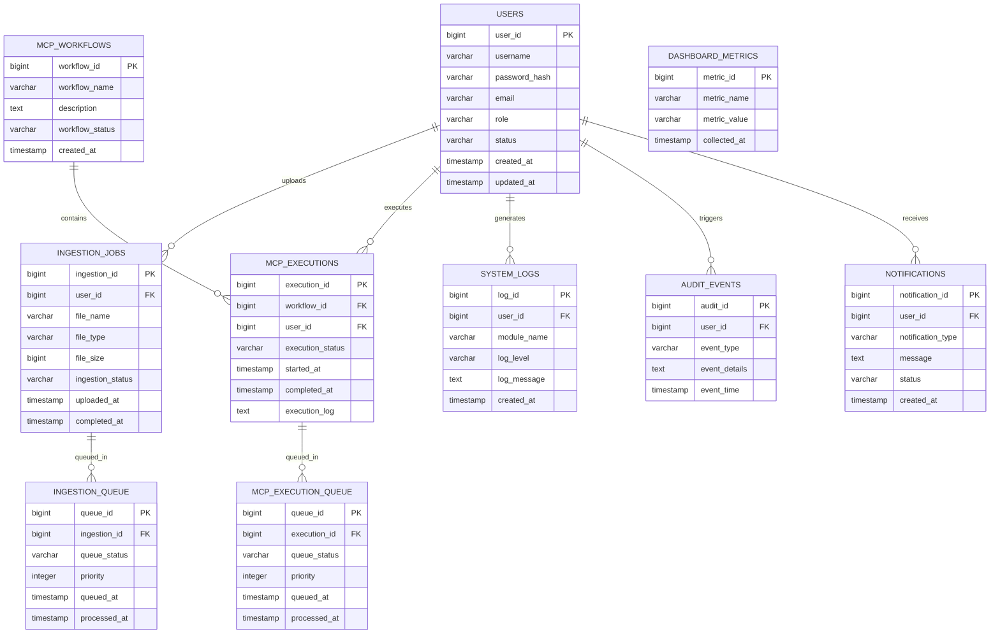

# Entity Relationship Diagram (ERD) - Version 1

## Project
Intelligent Quality Platform (IQP)

## Document Version
1.1

---

# 1. Overview

This document describes the revised database entity relationship design for the Intelligent Quality Platform (IQP).

This version introduces additional entities and relationships for:

- Workflow scheduling
- Notification management
- Audit tracking
- Concurrent processing support
- Execution queue management

---

# 2. High-Level Architecture

The database is designed to support:

- Secure user management
- Concurrent ingestion operations
- MCP workflow orchestration
- Real-time monitoring
- Audit logging
- Queue-based processing

---

# 3. ERD Diagram

---

# 4. Entity Definitions

---

# 4.1 USERS

## Description

Stores application user accounts and access information.

## Columns

| Column | Type | Description |
|---|---|---|
| user_id | bigint | Primary key |
| username | varchar | Unique username |
| password_hash | varchar | Encrypted password |
| email | varchar | User email |
| role | varchar | User role |
| status | varchar | Active/Inactive |
| created_at | timestamp | Account creation timestamp |
| updated_at | timestamp | Last update timestamp |

---

# 4.2 INGESTION_JOBS

## Description

Stores uploaded ingestion jobs submitted by users.

## Columns

| Column | Type | Description |
|---|---|---|
| ingestion_id | bigint | Primary key |
| user_id | bigint | FK to USERS |
| file_name | varchar | Uploaded file |
| file_type | varchar | File extension/type |
| file_size | bigint | File size |
| ingestion_status | varchar | Job status |
| uploaded_at | timestamp | Upload time |
| completed_at | timestamp | Completion time |

---

# 4.3 INGESTION_QUEUE

## Description

Stores ingestion queue records for concurrent processing management.

## Columns

| Column | Type | Description |
|---|---|---|
| queue_id | bigint | Primary key |
| ingestion_id | bigint | FK to INGESTION_JOBS |
| queue_status | varchar | Queue status |
| priority | integer | Queue priority |
| queued_at | timestamp | Queue timestamp |
| processed_at | timestamp | Processing timestamp |

---

# 4.4 MCP_WORKFLOWS

## Description

Stores MCP workflow definitions.

## Columns

| Column | Type | Description |
|---|---|---|
| workflow_id | bigint | Primary key |
| workflow_name | varchar | Workflow name |
| description | text | Workflow details |
| workflow_status | varchar | Active/Inactive |
| created_at | timestamp | Creation timestamp |

---

# 4.5 MCP_EXECUTIONS

## Description

Stores workflow execution history.

## Columns

| Column | Type | Description |
|---|---|---|
| execution_id | bigint | Primary key |
| workflow_id | bigint | FK to MCP_WORKFLOWS |
| user_id | bigint | FK to USERS |
| execution_status | varchar | Execution state |
| started_at | timestamp | Execution start |
| completed_at | timestamp | Execution completion |
| execution_log | text | Runtime logs |

---

# 4.6 MCP_EXECUTION_QUEUE

## Description

Stores MCP execution queue records for concurrent execution handling.

## Columns

| Column | Type | Description |
|---|---|---|
| queue_id | bigint | Primary key |
| execution_id | bigint | FK to MCP_EXECUTIONS |
| queue_status | varchar | Queue state |
| priority | integer | Queue priority |
| queued_at | timestamp | Queue timestamp |
| processed_at | timestamp | Processing timestamp |

---

# 4.7 DASHBOARD_METRICS

## Description

Stores operational monitoring metrics.

## Columns

| Column | Type | Description |
|---|---|---|
| metric_id | bigint | Primary key |
| metric_name | varchar | Metric name |
| metric_value | varchar | Metric value |
| collected_at | timestamp | Collection timestamp |

---

# 4.8 SYSTEM_LOGS

## Description

Stores application and infrastructure logs.

## Columns

| Column | Type | Description |
|---|---|---|
| log_id | bigint | Primary key |
| user_id | bigint | FK to USERS |
| module_name | varchar | Related module |
| log_level | varchar | INFO/WARN/ERROR |
| log_message | text | Log content |
| created_at | timestamp | Log timestamp |

---

# 4.9 AUDIT_EVENTS

## Description

Stores security and audit events.

## Columns

| Column | Type | Description |
|---|---|---|
| audit_id | bigint | Primary key |
| user_id | bigint | FK to USERS |
| event_type | varchar | Audit event type |
| event_details | text | Event description |
| event_time | timestamp | Event timestamp |

---

# 4.10 NOTIFICATIONS

## Description

Stores user notifications and alerts.

## Columns

| Column | Type | Description |
|---|---|---|
| notification_id | bigint | Primary key |
| user_id | bigint | FK to USERS |
| notification_type | varchar | Notification category |
| message | text | Notification content |
| status | varchar | SENT/READ/PENDING |
| created_at | timestamp | Creation timestamp |

---

# 5. Relationships

| Parent Entity | Child Entity | Relationship |
|---|---|---|
| USERS | INGESTION_JOBS | One-to-Many |
| USERS | MCP_EXECUTIONS | One-to-Many |
| USERS | SYSTEM_LOGS | One-to-Many |
| USERS | AUDIT_EVENTS | One-to-Many |
| USERS | NOTIFICATIONS | One-to-Many |
| INGESTION_JOBS | INGESTION_QUEUE | One-to-Many |
| MCP_WORKFLOWS | MCP_EXECUTIONS | One-to-Many |
| MCP_EXECUTIONS | MCP_EXECUTION_QUEUE | One-to-Many |

---

# 6. Database Design Considerations

## Performance

- Index frequently queried columns
- Optimize queue lookup queries
- Partition large logging tables

---

## Scalability

- Support concurrent ingestion processing
- Support distributed workflow execution
- Enable horizontal scaling

---

## Security

- Store password hashes only
- Maintain audit event tracking
- Enforce role-based access controls

---

# 7. Future Enhancements

Potential future database improvements include:

- Multi-tenant schema support
- Workflow versioning
- Event streaming integration
- Real-time notification system
- Distributed queue management

---